# PLUSLokaal — Schapkaarten

Flask-applicatie voor het maken van **PLUS-schapkaarten** (print-klare PDF's), plus scankaarten, labels,
een Canva-achtige designer, het **Portaal** (pluslokaal.nl in eigen jasje), **Winkelpakketten** (W2P),
gebruikers-/winkelbeheer, e-mail en printen. UI en kaartteksten zijn in het Nederlands.

> **Let op:** geheimen en data zitten **niet** in deze repo (zie `.gitignore`). De database, `.secret_key`,
> `.portaal_secret` en de gecachte W2P-PDF's worden per installatie lokaal aangemaakt/opgebouwd.

---

## Functies

> De schermafbeeldingen hieronder gebruiken **voorbeeld-/anonieme data** (fictieve gebruikers en winkels).

### Schapkaarten — dashboard & editor

Overzicht van je kaarten per winkel; zoeken, bewerken, printen, of nieuwe maken.

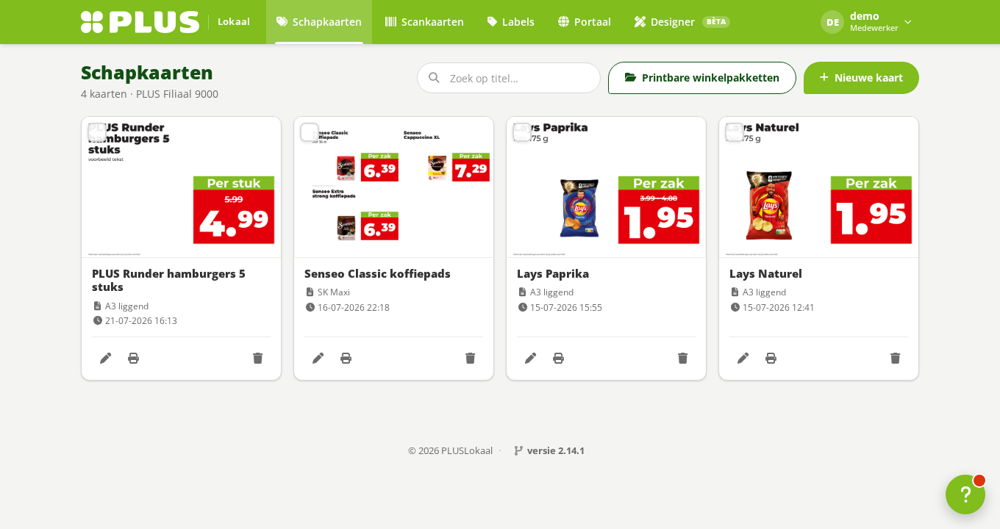

De **editor** heeft een **live voorbeeld dat exact de afdruk (PDF) is**. Je kunt overal direct in de preview
typen. Met **Zoek op plus.nl** neem je met vinkjes de **naam/merk, verpakking, prijs/actie én de foto** over.
Ondersteunde formaten: SK Mini/Middel/**Maxi (4-up)**, A5/A4/A3 (staand) en A3 liggend. Kaarttypes:
**actiekaart** (prijs, 2e halve prijs, %/€ korting, X+Y gratis, X=Y, X halen Y betalen) en **tip-kaart** —
op een SK Maxi kun je die zelfs **mixen** (bv. 3 actie + 1 tip op één vel).

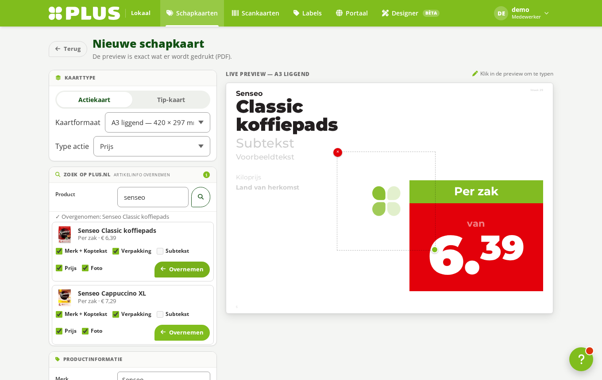

### Winkelpakketten (W2P)

Kant-en-klare weekpakket-schapkaarten per afdeling, rechtstreeks van pluslokaal.nl: **downloaden** (samengevoegd
per formaat) of **direct printen** op de winkelprinter. Verdwenen kaarten worden als **"niet meer beschikbaar"**
getoond en netjes overgeslagen.

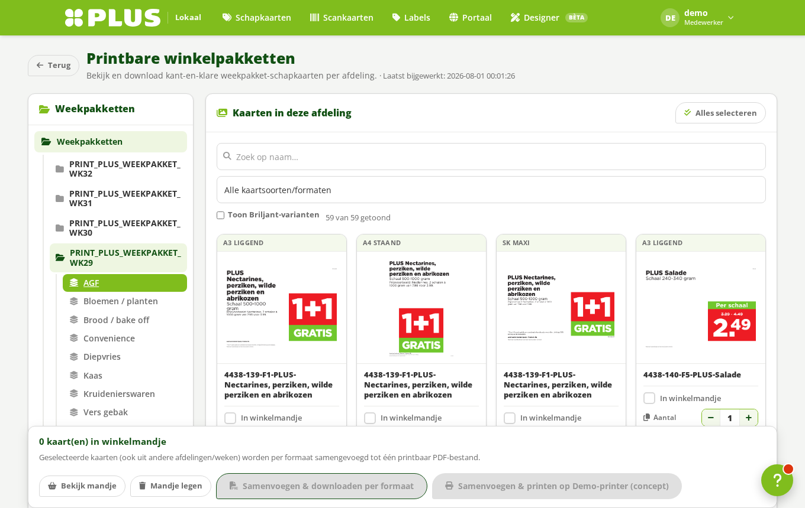

### Scankaarten, Designer & Portaal

- **Scankaarten** — kaarten met scanbare barcodes (EAN-8/13).
- **Designer (Bèta)** — een Canva-achtige editor op label of papier (tekst, vormen, iconen, foto's, PLUS-zoek).
- **Portaal** — de oude pluslokaal.nl (jaarkalender, tarieven, campagnes) **binnen** de app, in eigen stijl.

<p>
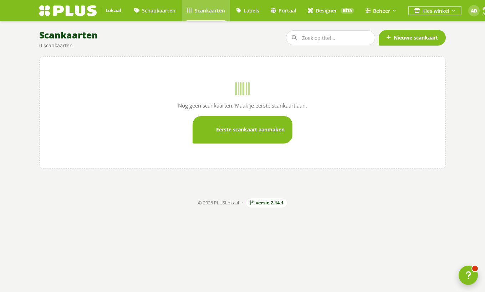 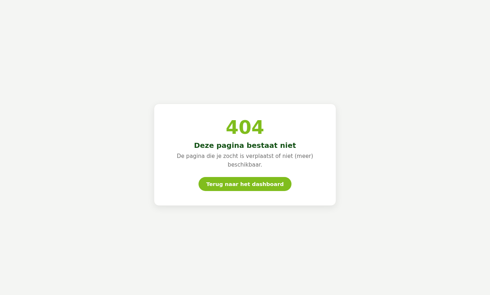
</p>

### Beheer (superadmin)

- **Gebruikers** — medewerkers/ondernemers per winkel; uitnodigen (welkomstmail), rol wijzigen, wachtwoord resetten.

  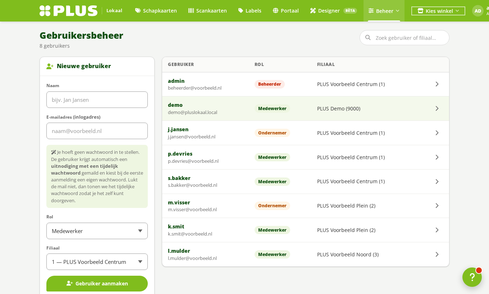

- **Filialen** — winkels + **winkelprinters** (IPP, per formaat de juiste lade).

  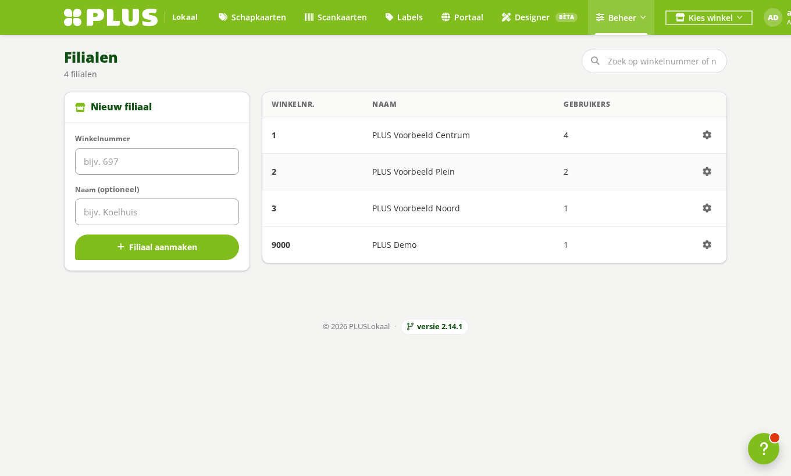

- **Winkelpakket-accounts** — de pluslokaal.nl-accounts (max. **6**) voor W2P-downloads; **meer accounts = sneller**
  (parallel). Plus per superadmin: **mail bij een mislukte sync/download** aan/uit.

  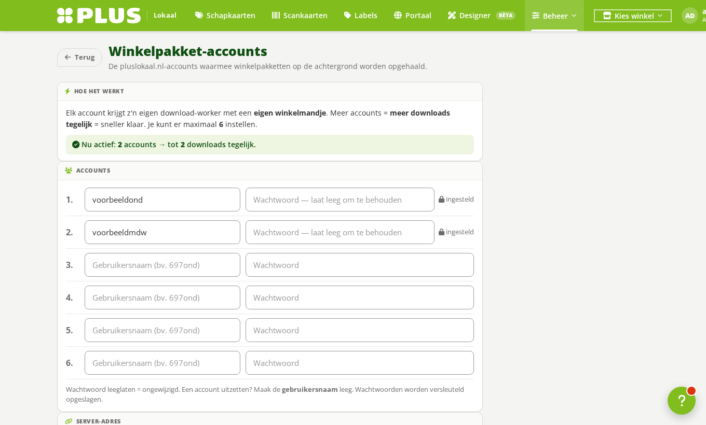

- **Rollen & rechten** — bepaal per rol wat mag.

  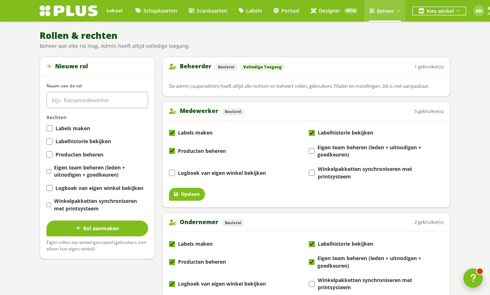

- **Opslag** — beheer de W2P-cache (weken bekijken/verwijderen, ruimte vrijmaken).

  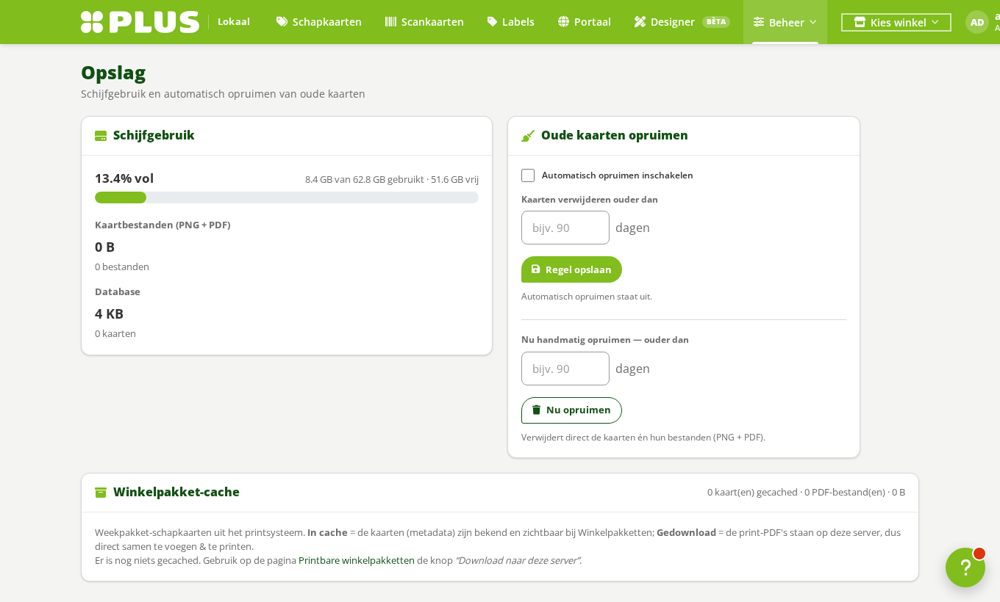

- Verder: **Mailinstellingen** (SMTP + testmail), **Demo-account** (aan/uit), **Logs**, **Feedback** en **Kennisbank**.

### Inloggen & beveiliging

Inloggen met e-mailadres of naam. Je blijft **een maand** ingelogd (overleeft het sluiten van de browser).
Voor **superadmins is 2FA (TOTP) verplicht**. Rollen: `admin` (superadmin), `ondernemer`, `medewerker`.

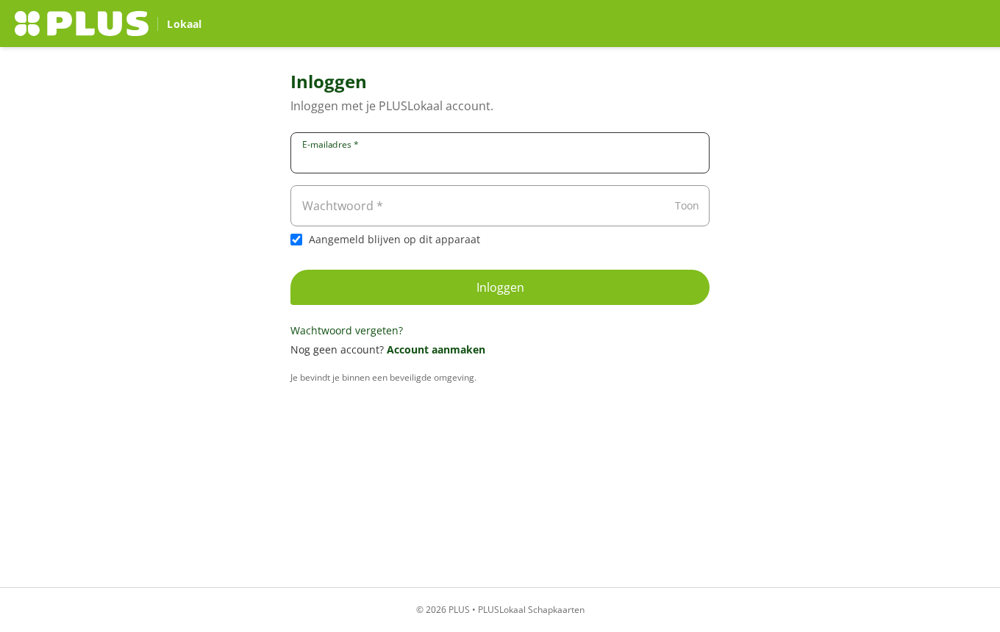

---

## Vereisten

- **Python 3.10+**
- **Linux** aanbevolen (getest op Ubuntu/Debian). Werkt ook op macOS/Windows voor ontwikkeling.
- Voor de **plus.nl-zoek** en **Winkelpakketten** draait een headless **Chromium** (via Playwright) —
  `install.sh` regelt dit, inclusief de benodigde systeembibliotheken.
- Voor **printen** naar winkelprinters is een netwerkprinter met **IPP** nodig (optioneel).

## Snel starten (ontwikkeling)

```bash
git clone <deze-repo> pluslokaal
cd pluslokaal
bash install.sh          # venv + pakketten + Chromium (+ systeem-deps)

source .venv/bin/activate
python app.py            # start op http://localhost:5000
```

Handmatig (zonder script) komt neer op:
```bash
python3 -m venv .venv && source .venv/bin/activate
pip install -r requirements.txt
python -m playwright install chromium && python -m playwright install-deps chromium
python app.py
```

Bij de **eerste start** gebeurt automatisch:
- `.secret_key` / `.portaal_secret` worden aangemaakt (sessie-ondertekening + versleuteling).
- de SQLite-database `instance/pluslokaal.db` wordt aangemaakt + gemigreerd.
- een **admin-account** wordt aangemaakt: gebruikersnaam `admin`, wachtwoord `admin` → **wijzig dit direct**.

Inloggen kan met e-mailadres of met de naam `admin`.

---

## Productie (aanbevolen)

Draai met **gunicorn** (config staat in `gunicorn_conf.py`):

```bash
python3 -m gunicorn -c gunicorn_conf.py app:app
```

De config gebruikt bewust **1 worker + threads** … zie de uitleg boven in `gunicorn_conf.py`. Voor méér
doorvoer over alle cores kan het naar meerdere workers (de gedeelde state staat al in SQLite/`sharedstate.py`).

### Als systemd-service (Linux)

Zie `deploy/pluslokaal.service` — pas het pad aan en:

```bash
sudo cp deploy/pluslokaal.service /etc/systemd/system/pluslokaal.service
sudo systemctl daemon-reload
sudo systemctl enable --now pluslokaal
```

Achter een reverse proxy / Cloudflare-tunnel: de app staat achter `ProxyFix` (leest `X-Forwarded-*`),
dus HTTPS/host worden correct herkend.

---

## Configuratie (na installatie, via Beheer)

Als **superadmin** (`admin`) onder **Beheer**:
- **Mailinstellingen** — SMTP (bv. Resend) voor uitnodigingen/reset-mails.
- **Filialen** — winkels + winkelprinters (IPP).
- **Winkelpakket-accounts** — pluslokaal.nl-accounts (max. 6) voor W2P-downloads; meer accounts = sneller.
  Ook: per admin mail-bij-mislukte-sync/download aan/uit.
- **Opslag** — W2P-cache beheren (weken downloaden/verwijderen).
- **Demo-account** — aan/uit (login `demo`/`demo`, gesimuleerd printen).

Het **Portaal** koppel je per gebruiker via het profiel (pluslokaal.nl-account).

---

## Structuur

| Bestand | Functie |
|---|---|
| `app.py` | de volledige backend (modellen, routes, PDF-renderer) |
| `w2p_client.py` | Winkelpakketten (W2P) download-workers (Playwright) |
| `plus_search.py` | plus.nl-productzoek (gedeelde warme browser + service) |
| `sharedstate.py` | proces-overstijgende state (print/W2P-jobs, rate-limiting) |
| `templates/`, `static/` | Jinja-templates en de PLUS-stijl (`static/css/plus.css`) |
| `docs/` | stijlgids, logo's, presentatie, integratie-documenten |
| `gunicorn_conf.py` | productie-serverconfig |

Zie `CLAUDE.md` voor de uitgebreide ontwikkelaarsgids.
